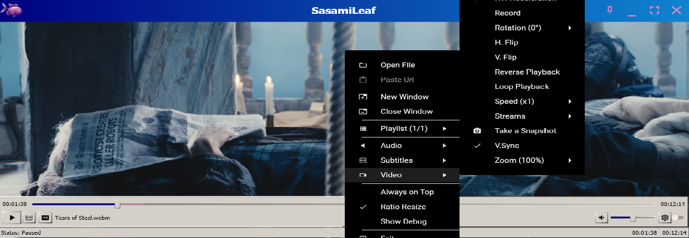

# SasamiLeaf

**A Windows media player and .NET/WPF media library built on FFmpeg, DirectX, and Flyleaf.**



[](https://github.com/skonester/SasamiLeaf/releases)
[](https://github.com/skonester/SasamiLeaf/releases)
[](LICENSE.txt)
[](https://dotnet.microsoft.com/)
[](https://www.microsoft.com/windows)
[](https://learn.microsoft.com/dotnet/desktop/wpf/)
[](https://ffmpeg.org/)
[](https://learn.microsoft.com/windows/win32/directx)
[](https://www.nuget.org/packages/FlyleafLib)
[](https://www.nuget.org/packages/FlyleafLib)

---

## What It Is

SasamiLeaf is a desktop media player built from Flyleaf's FFmpeg/DirectX playback stack. It is designed for smooth local and streaming playback, responsive WPF integration, and practical distribution as a self-contained Windows app.

The repository also includes the reusable Flyleaf-based libraries and plugins used by the player.

## Quick Links

- **Downloads:** [GitHub Releases](https://github.com/skonester/SasamiLeaf/releases)
- **Library packages:** [NuGet Flyleaf packages](https://www.nuget.org/packages?q=flyleaf)
- **License:** [LGPL-3.0-or-later](LICENSE.txt)
- **Upstream project:** [SuRGeoNix/Flyleaf](https://github.com/SuRGeoNix/Flyleaf)
- **Upstream documentation:** [Flyleaf Wiki](https://github.com/SuRGeoNix/Flyleaf/wiki)

## Highlights

- **Broad media support:** Audio, video, images, playlists, capture devices, network streams, and plugin-backed protocols.
- **FFmpeg powered:** Supports FFmpeg 7.1 and 8.0 bindings depending on the target project.
- **Hardware accelerated rendering:** Direct3D/DirectX rendering with video acceleration and custom pixel shader support.
- **Smooth controls:** Fast open, play, pause, stop, seek, frame stepping, stream switching, and cancellation-aware threading.
- **WPF friendly:** DPI-aware `FlyleafHost` and a ready-to-style `FlyleafME` media element.
- **Extensible:** Custom I/O streams, protocol handlers, subtitle conversion, online subtitles, torrent playback, and yt-dlp integration.
- **Installer ready:** Includes `Build_Installer.bat` and an Inno Setup script for packaging a self-contained Windows installer.

## Recent Changes

April 30 update:

- Added click-anywhere video play/pause toggling.
- Automatically collapse the title bar and status bar during fullscreen or inactivity.
- Increased seeker bar and control button target sizes for easier interaction.
- Moved configuration files to `AppData` to avoid crashes when installed under `C:\Program Files`.
- Added null-safety around tray icon and single-instance activation paths.
- Finalized automated publish preparation with `Build_Installer.bat` and `SasamiLeaf_Installer.iss`.

## Build From Source

Requirements:

- Windows
- .NET SDK with Windows desktop workload support
- FFmpeg files from this repository
- Inno Setup, only if you want to build the installer

Build the app:

```powershell
dotnet build SasamiLeaf\SasamiLeaf.csproj
```

Publish a self-contained Win-x64 build:

```powershell
dotnet publish SasamiLeaf\SasamiLeaf.csproj -c Release -r win-x64 --self-contained true -p:PublishSingleFile=false -o publish_out
```

Prepare installer files:

```bat
Build_Installer.bat
```

Then compile `SasamiLeaf_Installer.iss` with Inno Setup to generate `SasamiLeaf_Setup.exe`.

## Project Layout

| Path | Purpose |
| --- | --- |
| `SasamiLeaf/` | WPF desktop player application. |
| `FlyleafLib/` | Core media playback library. |
| `FlyleafLib.Controls.WPF/` | WPF controls and media element integration. |
| `Plugins/` | Optional protocol, subtitle, torrent, and web media plugins. |
| `FFmpeg/` | Runtime FFmpeg binaries used by published builds. |
| `Images/` | Repository images and package assets. |
| `Build_Installer.bat` | Publishes the app into `publish_out`. |
| `SasamiLeaf_Installer.iss` | Inno Setup installer definition. |

## Feature Overview

### Playback

- Open, play, pause, stop, seek, and stream switch.
- Speed control, reverse playback, low-latency modes, and zero-latency modes.
- Seek backward/forward by short or large steps.
- Seek to time, frame, or chapter.
- Frame stepping.

### Video

- Enable or disable video streams.
- Device preference selection.
- Keep, fill, or custom aspect ratio modes.
- Deinterlacing, including double-rate support with D3D11VP.
- HDR-to-SDR conversion with Aces, Hable, and Reinhard tone mapping.
- Pan, move, zoom, rotate, horizontal flip, vertical flip, and cropping.
- Recording and snapshots.
- NVIDIA and Intel super resolution support through D3D11VP.
- Video acceleration, video filters, video processors, VSync, zero-copy rendering, split-frame, and alpha packing.

### Audio

- Enable or disable audio streams.
- Device preference selection.
- Audio delay adjustment.
- Volume up, down, and mute.
- System language priorities for audio streams.

### Subtitles

- Enable or disable subtitle streams.
- Subtitle delay adjustment.
- Bitmap subtitle support.
- Advanced character detection and UTF-8 conversion through the SubtitlesConverter plugin.
- System language priorities for subtitle streams.

### FFmpeg

- HLS live seeking.
- Capture devices using compact URLs such as `fmt://gdigrab?desktop&framerate=30`.
- Patched FFmpeg behavior for known HLS and .NET interop issues.
- FFmpeg 7.1 and 8.0 binding support.

### UI Controls

`FlyleafHost`:

- Attach and detach.
- Activity and idle modes.
- Drag move, drag-and-drop swap, and drag-and-drop open.
- Fullscreen and normal screen modes.
- Resize with optional aspect ratio preservation.
- Z-order control.

`FlyleafME`:

- WPF media element control.
- Media bar, slider, popup menu, and settings dialog.
- Material Design based color themes.
- Style and control template customization.

### Plugins

- **OpenSubtitlesOrg:** Search and download online subtitles.
- **SubtitlesConverter:** Detect subtitle encoding and convert input text to UTF-8.
- **TorrentBitSwarm:** Stream media from torrents before the full download completes.
- **YoutubeDL:** Play web media that is not directly accessible through HTTP(S).

### Library Uses

- Embed a hardware-accelerated media surface in a WPF app.
- Use the player implementation as a ViewModel with `PropertyChanged` and observable collection notifications.
- Build an audio-only player without hosting a video surface.
- Download, remux, or extract frames from supported media.
- Customize mouse and keyboard bindings for embedded or custom actions.

## Technology

| Area | Stack |
| --- | --- |
| Runtime | .NET 8 / .NET 10 Windows targets |
| UI | WPF, WinForms interop support, WinUI/WinForms partial host support |
| Media | FFmpeg, Flyleaf.FFmpeg.Bindings |
| Rendering | DirectX, Direct3D11, DirectComposition, Vortice.Windows |
| Audio | XAudio2 |
| Packaging | `dotnet publish`, Inno Setup |

## Credits

SasamiLeaf is based on the Flyleaf project and the work of many open-source media projects and libraries.

Core:

- [FFmpeg](https://ffmpeg.org/)
- [FFmpeg.AutoGen](https://github.com/Ruslan-B/FFmpeg.AutoGen/)
- [Flyleaf.FFmpeg.Bindings](https://github.com/SuRGeoNix/Flyleaf.FFmpeg.Generator)
- [Vortice.Windows](https://github.com/amerkoleci/Vortice.Windows)
- [VLC](https://github.com/videolan/vlc), [Kodi](https://github.com/xbmc/xbmc), [MPV](https://github.com/mpv-player/mpv), [MPC-BE](https://github.com/Aleksoid1978/MPC-BE), and [FFplay](https://github.com/FFmpeg/FFmpeg/blob/master/fftools/ffplay.c)

UI:

- [Dragablz](https://github.com/ButchersBoy/Dragablz)
- [MaterialDesignInXamlToolkit](https://github.com/MaterialDesignInXAML/MaterialDesignInXamlToolkit/)

Plugins:

- [BitSwarm](https://github.com/SuRGeoNix/BitSwarm)
- [OpenSubtitles.org](https://www.opensubtitles.org/)
- [yt-dlp](https://github.com/yt-dlp/yt-dlp)
